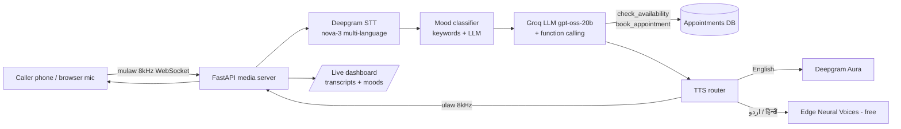

<div align="center">

# 🎙️ Voice Agent

### A production-style AI phone receptionist that speaks English, Urdu & Hindi

[](.github/workflows/ci.yml)
[](https://www.python.org/)
[](tests/)
[](LICENSE)
[](README.md#-api-keys-all-free)

*Real-time voice agent · Live language switching · Real appointment booking · Mood-aware empathy*

</div>

---

A complete voice AI agent for a healthcare clinic front-desk: it answers calls,
converses naturally like a human (switching between English ↔ اردو ↔ हिन्दी mid-sentence),
**actually books appointments** into a database via function calling, senses when a
caller is frustrated and softens its tone, and logs every conversation to a live dashboard.

Built entirely on **free API tiers** — no credit card needed to run this project.

## ✨ What Makes It Different

| | Typical demo bots | This project |
|---|---|---|
| Booking | *"Sure, I booked you!"* (hallucinated) | Function-calling into real DB — double-booking impossible |
| Language | One language only | Auto code-switch EN/UR/HI per sentence, human-style |
| Interruption | Ignores you / breaks | Barge-in with echo guard, partial context preserved |
| Caller emotion | Ignored | Mood detected per utterance → empathy hints prime replies |
| Cost | Paid APIs everywhere | Groq free tier + Deepgram $200 credit + Edge TTS ($0) |
| Observability | print() | Per-turn latency metrics + live transcript dashboard |

## 🏗️ Architecture



## 🚀 Quick Start

```bash
git clone https://github.com/<you>/voice-agent.git
cd voice-agent
pip install -r requirements.txt
copy .env.example .env        # fill in 2 keys (below)
uvicorn main:app --port 8000
```

### 🏃 How to Run the Agent (step by step)

**Prerequisites:** Python 3.11+ installed (`python --version`).

1. **Install dependencies**

   ```bash
   pip install -r requirements.txt
   ```

2. **Configure API keys** — copy the example env and fill in at least
   `DEEPGRAM_API_KEY` and `GROQ_API_KEY` (both free, see [API Keys](#-api-keys-all-free)):

   ```bash
   # Windows (cmd/PowerShell)
   copy .env.example .env
   # macOS / Linux
   cp .env.example .env
   ```

3. **Start the server**

   ```bash
   uvicorn main:app --host 0.0.0.0 --port 8000 --reload
   ```

   You should see `INFO uvicorn ... Application startup complete.` — server is live on port 8000.
   Drop `--reload` for production-style runs; add `--log-level debug` while debugging.

4. **Verify it's running** — hit the health check:

   ```bash
   curl http://localhost:8000/health      # → {"status":"ok"}
   ```

5. **Talk to the agent** — open **http://localhost:8000/demo**, click *Start Talking*, allow mic access and just speak.
   Watch live transcripts + moods on **http://localhost:8000/dashboard** and per-turn latency at **http://localhost:8000/stats**.

6. **(Optional) Real phone calls** — run `ngrok http 8000`, put that URL in `.env` as `BASE_URL`, then point your Twilio number's voice webhook to `<ngrok-url>/twilio/inbound`. See [Real Phone Calls](#-real-phone-calls).

7. **Stop the agent** — press `Ctrl+C` in the terminal running uvicorn.

### ⌨️ Everyday Commands (copy-paste)

Daily use ke liye bas yeh commands — project folder mein terminal kholo:

**Start (Windows PowerShell / cmd):**

```powershell
cd "C:\path\to\Voice Agent"
python -m uvicorn main:app --port 8000
```

**Start (macOS / Linux):**

```bash
cd voice-agent
python3 -m uvicorn main:app --port 8000
```

> Tip: code badalte waqt `--reload` flag add karo, server khud restart hoga.

**Check chal raha hai ya nahi:**

```powershell
curl http://localhost:8000/health        # → {"status":"ok"}
```

```bash
# macOS / Linux
curl http://localhost:8000/health
```

Agar browser se check karna ho: **http://localhost:8000/health** kholo.

**Stop karna:**
- Terminal mein jahan server chal raha hai wahan **`Ctrl + C`** dabao.
- Agar terminal band ho gayi ho aur process phans jaye:

```powershell
# Windows - port 8000 ka process dhoondo aur kill karo
netstat -ano | findstr :8000
taskkill /PID <upar-wala-PID> /F
```

```bash
# macOS / Linux
lsof -ti :8000 | xargs kill -9
```

**Tests chalana (kuch bhi change karne ke baad):**

```powershell
python -m pytest tests -q
```

Try saying:
- *"Book an appointment tomorrow at 3 PM"* → real slot checked, confirmation asked, booking saved
- *"مجھے کل کا اپائنٹمنٹ چاہیے"* → agent switches to Urdu instantly
- Interrupt it mid-sentence — it stops and listens like a human

## 🔑 API Keys (all free)

| Key | Get it from | Free amount |
|-----|-------------|-------------|
| `DEEPGRAM_API_KEY` | [console.deepgram.com](https://console.deepgram.com) | $200 credit |
| `GROQ_API_KEY` | [console.groq.com](https://console.groq.com) | unlimited-ish free tier |
| `TWILIO_*` | [console.twilio.com](https://console.twilio.com) | trial credit *(only for real phone calls)* |

Optional swaps: `LLM_PROVIDER=anthropic` (Claude) or ElevenLabs TTS.

## 📞 Real Phone Calls

1. Expose the server: `ngrok http 8000` → put URL in `.env` as `BASE_URL`
2. Twilio console → your number → **Voice webhook** → `https://<your-url>/twilio/inbound`
3. Outbound campaigns: `POST /call` with `X-API-Key` header (TCPA guards built in:
   DNC list, consent records, calling-hours window)

## 📊 Screenshots

| Dashboard (`/dashboard`) | Demo (`/demo`) |
|---|---|
| Live transcripts + mood badges, auto-refreshes during calls | Browser mic pipeline test — no Twilio needed |

*(add your GIFs here — record with [Kap](https://getkap.co) or OBS)*

## 🧪 Testing

60 offline tests — zero API spend:

```bash
python -m pytest tests -q
```

Covers TwiML generation, TCPA queue policy, webhook auth, LLM function-calling
round-trips, booking rules (double-book/past-date/hours guards), language detection,
TTS mp3→mulaw pipeline, mood classification priority, dashboard APIs.

## 🗺️ Endpoints

| Route | Purpose |
|-------|---------|
| `GET /demo` | Browser mic demo |
| `GET /dashboard` | Conversation + mood dashboard |
| `GET /calls` · `GET /calls/{id}/transcript` | Dashboard JSON APIs |
| `GET /stats` | Latency breakdown per turn |
| `POST /twilio/*` | Inbound/outbound/AMD/status webhooks |
| `POST /call` `/call/batch` `/call/csv` | Outbound dialing (admin-key protected) |

## 🤝 Contributing

PRs welcome! Ideas that would level this up:
1. Provider fallback chain (Groq→Anthropic on rate-limit)
2. Mid-call STT reconnect without dropping audio
3. SMS confirmations after booking
4. Multi-tenant campaigns

```bash
git checkout -b feature/amazing-thing
python -m pytest tests -q     # keep them green
git commit -m "feat: amazing thing"
```

## ⭐ Support

If this helped you build something, please **star the repo** — it genuinely helps others find it.

## 📄 License

MIT — see [LICENSE](LICENSE).

> ⚠️ Healthcare data note: transcripts may contain PHI. The DB layer auto-uses SQLCipher
> encryption on Linux; on Windows dev it falls back to plain SQLite with loud warnings.
> For real patient deployments you need signed BAAs with every provider.
